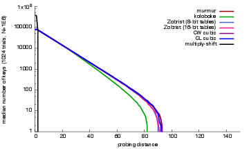
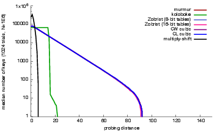

## Experimental results

### Sept. 15th 2016

I generate 1024 1-million-key hash tables from a "geometric model",
meaning that for each of the 1024 trials, a range [x,x+1000000) is
picked at random (x is a random 64-bit integer), all integers in the
range are shuffled and then they are inserted in the hash table.
Whenever a new hash table is constructed, random hash functions are
randomized.

We want the load to be as high as possible to "stress" the hash functions.
In these particular tests, the effective load is effectiveload= 0.953674
meaning that 95% of the buckets are occupied. (The bucket count is limited
to a power of two and picked to be 1048576 in this instance.)

We use Robin-Hood linear probing. Any other form of linear probing would
have worse probing distances and Robin-Hood hashing is well suited to
hash tables with high load factors.

After generating each 1-million-key hash table, we build a histogram of the
count of keys having a given probing distance (where probing distances are
at zero when there is no collision).

Given these histograms, we can compute, for each probing distance, the minimum,
the maximum, the median and so forth.

We can then plot these results:

- [sept15_2016_geometric_firstquartilecount.pdf](sept15_2016_geometric_firstquartilecount.pdf)
- [sept15_2016_geometric_maximalcount.pdf](sept15_2016_geometric_firstquartilecount.pdf)
- [sept15_2016_geometric_mediancount.pdf](sept15_2016_geometric_mediancount.pdf)
- [sept15_2016_geometric_minimalcount.pdf](sept15_2016_geometric_minimalcount.pdf)
- [sept15_2016_geometric_thirdquartilecount.pdf](sept15_2016_geometric_thirdquartilecount.pdf)

How to interpret: a hash function with a bad wost-case behavior would
have some cases where the "maximal" count for large probing distances would
be high. So looking at  [sept15_2016_geometric_maximalcount.pdf](sept15_2016_geometric_firstquartilecount.pdf) is a good
way to see which hash functions are "robust".

Note that the y axis is on a logarithmic scale, so small apparent differences
are more significant that they appear.

You can compare with the median counts:

Result:

Multiply-shift is interesting. It will provide a much smaller median probing distance. It has a good "median case",
but it also fares very poorly some of the time as indicated by the maximum counts.

Out of the other hash functions, kolokobe stands out as being particularly robust. It has fewer "long probes".

Zobrist, murmur and CW cubic are difficult to distinguish.

### Sept. 16th 2016

We repeat the same analysis but this time, the bits of the keys are reversed. So
we start from the same keys [x,1000000+x) but then we "reverse the bits" (transforming
  sum a_i 2^i into sum a_i 2^(w-i) ) of each key.

We can then plot these results:

- [sept16_2016_geometric_firstquartilecount.pdf](sept16_2016_geometric_firstquartilecount.pdf)
- [sept16_2016_geometric_maximalcount.pdf](sept16_2016_geometric_firstquartilecount.pdf)
- [sept16_2016_geometric_mediancount.pdf](sept16_2016_geometric_mediancount.pdf)
- [sept16_2016_geometric_minimalcount.pdf](sept16_2016_geometric_minimalcount.pdf)
- [sept16_2016_geometric_thirdquartilecount.pdf](sept16_2016_geometric_thirdquartilecount.pdf)

So looking at  [sept16_2016_geometric_maximalcount.pdf](sept16_2016_geometric_firstquartilecount.pdf) is a good
way to see which hash functions are "robust".

You can compare with the median counts:

Results:

Zobrist, murmur and CW cubic are difficult to distinguish.
